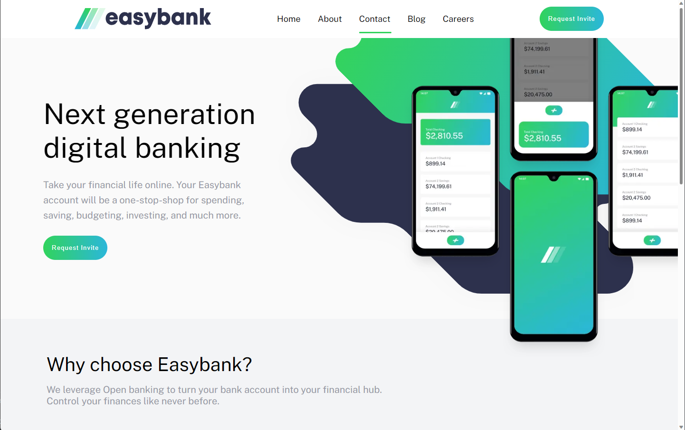
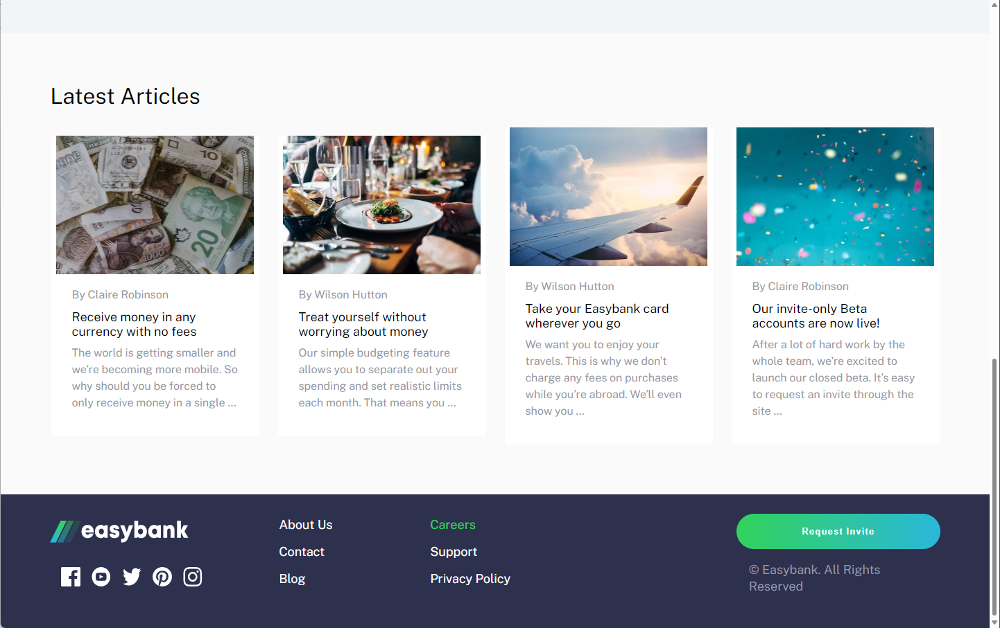
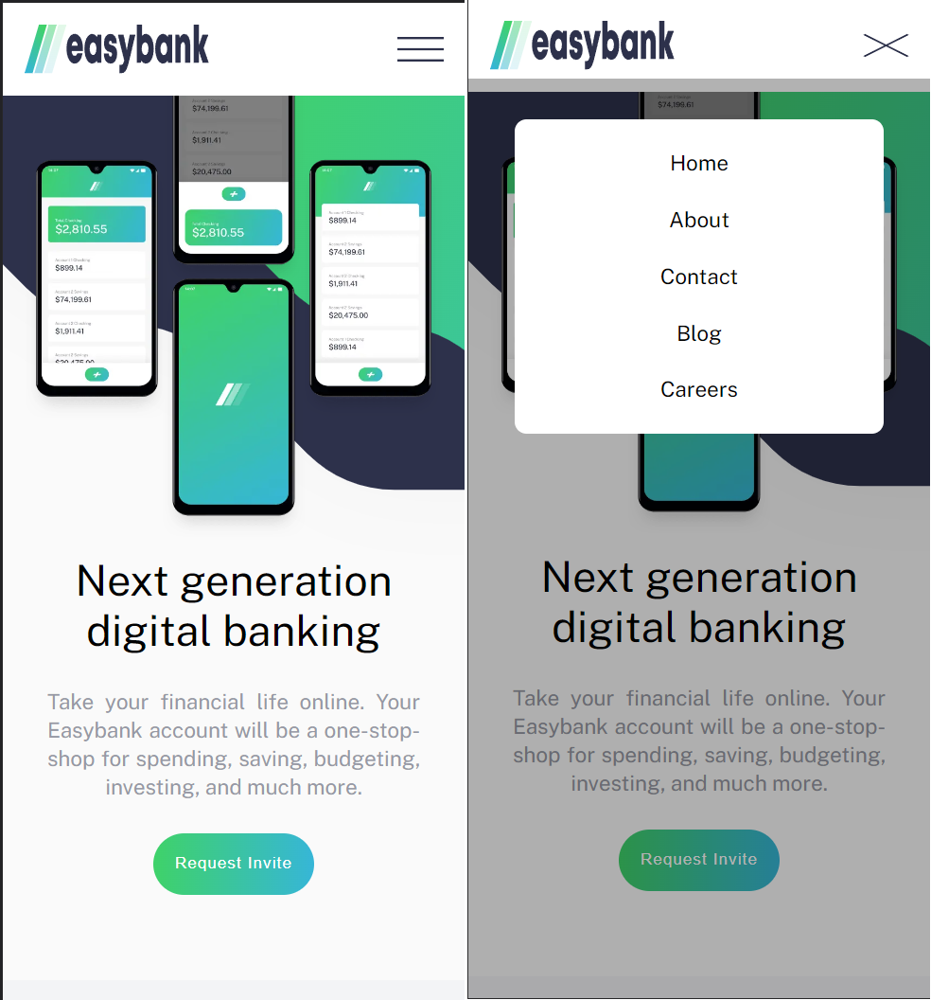

# Frontend Mentor - QR code component solution

## Table of contents

- [Overview](#overview)
  - [Screenshot](#screenshot)
  - [Links](#links)
- [My process](#my-process)
  - [Built with](#built-with)
  - [What I learned](#what-i-learned)
  - [Continued development](#continued-development)
- [Author](#author)
- [Acknowledgments](#acknowledgments)

## Overview

### Screenshot

- Desktop view
  
  

- Mobile View

### Links

- Solution URL: https://github.com/mrxshinji/interactive-space-tourism

- Live Site URL: https://mrxshinji.github.io/interactive-space-tourism

## My process

### Built with

- Semantic HTML5 markup
- Flexbox
- Mobile-first workflow
- [React](https://reactjs.org/) - React Framework 
- [Nextjs](https://nextjs.org/) - Next js framework

### What I learned

- Practicing basic after learning next js 

### Continued development

- React and Next in TypeScript

## Author

- Github - [https://github.com/mrxshinji]
- Frontend Mentor - [@mrxshinji](https://www.frontendmentor.io/profile/mrxshinji)

## Acknowledgments

-- Frontend Mentor for this project and awesome figma sketch~
